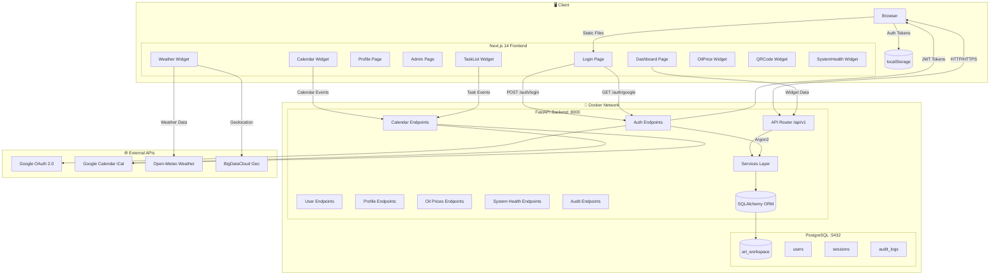
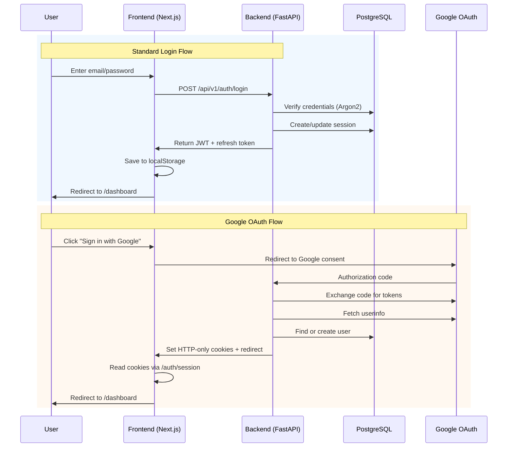
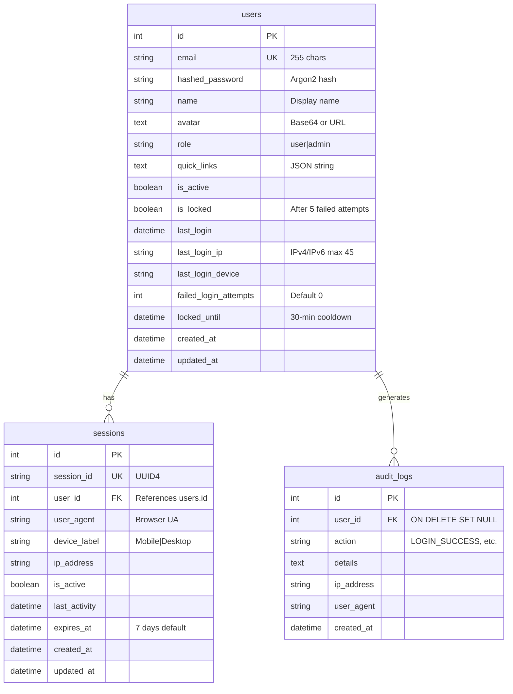

# 📋 Project Analysis Report: ART Workspace

**Generated:** June 11, 2026  
**Analyst:** Software Architect & Principal Cybersecurity Engineer  
**Scope:** Full-stack Deep-Dive Module-Level Inspection  
**Repository:** [ARTTT31/PROJECT_ART](https://github.com/ARTTT31/PROJECT_ART)

---

## 1. Executive Summary & Tech Stack Overview

ART Workspace is a Thai-language personal productivity dashboard built on a modern full-stack architecture. The system consolidates real-time widgets (weather, calendar, tasks, oil prices), authentication, and admin tools into a single calm workspace interface.

### Tech Stack (Actual)

| Layer | Technology | Version | Status |
|-------|-----------|---------|--------|
| **Frontend Framework** | Next.js (App Router) | 14.1.0 | ✅ Active |
| **UI Library** | React | 18.2.0 | ✅ Active |
| **Language** | TypeScript | 5.3.3 | ✅ Active |
| **Styling** | Tailwind CSS | 3.4.1 | ✅ Active |
| **Icons** | Lucide React | 0.312.0 | ✅ Active |
| **State/Data** | React Context + TanStack React Query | 5.17.19 | ✅ Active |
| **Form Validation** | React Hook Form + Zod | 7.49.3 / 3.22.4 | ✅ Active |
| **DnD** | @dnd-kit | 6.3.1 / 10.0.0 | ✅ Active |
| **Backend Framework** | FastAPI | 0.109.0 | ✅ Active |
| **ORM** | SQLAlchemy | 2.0.25 | ✅ Active |
| **Migration** | Alembic | 1.13.1 | ✅ Active |
| **Auth** | JWT (python-jose) | 3.3.0 | ✅ Active |
| **Password Hashing** | Argon2 (via passlib) | — | ⚠️ Missing dependency |
| **Database** | PostgreSQL 15 (Alpine) | 15 | ✅ Active |
| **Rate Limiting** | SlowAPI | 0.1.9 | ✅ Active |
| **Container** | Docker Compose | — | ✅ Active |
| **Testing (Backend)** | Pytest | 7.4.4 | 🟡 Partial |

### Project Metrics

- **Frontend Pages:** 5 (Login, Dashboard, Profile, Admin, Login-Success)
- **Backend Endpoints:** 20+ (Auth, Users, Profile, Calendar, Oil Prices, Audit, System)
- **Widgets:** 6 (Weather, Calendar, TaskList, OilPrice, QRCode, SystemHealth)
- **Database Tables:** 3 (users, sessions, audit_logs)
- **Docker Services:** 3 (postgres, backend, frontend)
- **Test Coverage:** Backend only (~2 test files)
- **Lines of CSS:** ~1,515 (globals.css) + 2 page-specific CSS files

---

## 2. System Architecture & Data Flow



### Authentication Flow



---

## 3. Deep-Dive Findings Classified by Severity

### 🔴 Critical Findings

#### CRIT-01: Missing Argon2 Dependency Causes Runtime Failure
- **File:** `backend/requirements.txt`, `backend/app/core/security.py`
- **Detail:** `security.py` line 12 uses `CryptContext(schemes=["argon2"], deprecated="auto")` but `requirements.txt` does NOT list `argon2-cffi`. The listed `passlib[bcrypt]==1.7.4` includes bcrypt scheme only. Starting the backend will throw `ValueError: unknown password scheme: 'argon2'`.
- **Impact:** **System will not start.** Login is completely broken.
- **Fix:** Add `argon2-cffi>=23.1.0` to `requirements.txt`, or switch back to `schemes=["bcrypt"]` since `bcrypt==4.1.2` is already listed.

#### CRIT-02: JWT Tokens Stored in localStorage (XSS Surface)
- **Files:** `frontend/src/components/Auth/AuthProvider.tsx` (lines 121-124), `frontend/src/app/login/page.tsx` (lines 123-126), `frontend/src/app/dashboard/page.tsx` (line 72)
- **Detail:** Access tokens, refresh tokens, session IDs, and user data are stored in `localStorage`. Any XSS vulnerability in any widget or third-party script would allow exfiltration of all tokens, enabling persistent account takeover.
- **Impact:** **Critical security vulnerability.** Refresh tokens last 7 days.
- **Fix:** Use HTTP-only cookies for token storage (like the Google OAuth path already does). For the standard login flow, move tokens from localStorage to HTTP-only cookies with `Secure`, `SameSite=Strict` flags.

#### CRIT-03: SECRET_KEY Not Configured in .env.example — Missing at Runtime
- **Files:** `backend/.env.example`, `docker-compose.yml`
- **Detail:** `docker-compose.yml` line 38 sets `SECRET_KEY: ${SECRET_KEY}` with no default. The `.env.example` file doesn't include a `SECRET_KEY` variable. `config.py` makes `SECRET_KEY` a required field with no default. If `.env` is missing or incomplete, FastAPI will throw an error on startup.
- **Impact:** **Startup failure** if `.env` file is incomplete. No fallback or error guidance.
- **Fix:** Add `SECRET_KEY` to `.env.example` with a clear comment, and add a startup validation check.

#### CRIT-04: Google OAuth Lacks ID Token Verification
- **File:** `backend/app/api/v1/endpoints/auth.py` (lines 222-231)
- **Detail:** The Google callback exchanges the authorization code for tokens and uses the `access_token` to call `https://www.googleapis.com/oauth2/v3/userinfo`. It does NOT verify the `id_token` from Google, making it possible (though unlikely) for a manipulated token to pass.
- **Impact:** **Medium security risk.** The ID token (JWT signed by Google) should be verified using Google's public keys to ensure the token came from Google and hasn't been tampered with.
- **Fix:** Parse and verify the `id_token` from Google's token response using `google-auth` library or manually verify the JWT signature.

#### CRIT-05: Frontend API URL Misconfigured in Docker Compose
- **File:** `docker-compose.yml` line 71
- **Detail:** `NEXT_PUBLIC_API_URL: ${NEXT_PUBLIC_API_URL:-http://localhost:3000}` defaults to port **3000** (frontend's own port) instead of port **8000** (backend). The frontend login page uses this env var to construct API calls to `/api/v1/auth/login`.
- **Impact:** **Login broken in production Docker deployment** unless explicitly overridden in `.env`. The frontend tries to POST login to itself on port 3000 instead of the backend on port 8000.
- **Fix:** Change default to `http://localhost:8000` or `http://backend:8000`.

---

### 🟡 Medium Findings

#### MED-01: Inline Imports Scattered Across Endpoints
- **Files:** `backend/app/api/v1/endpoints/profile.py` (lines 44, 88, 178, 198), `users.py` (lines 65, 106, 146)
- **Detail:** Multiple `from app.services.audit_service import AuditService` imports are placed inside function bodies. This is a Python anti-pattern that increases overhead, confuses import analysis tools, and suggests circular import workarounds.
- **Impact:** Minor performance overhead, code smell, complicates static analysis.
- **Fix:** Move all imports to top of file. If circular imports exist, restructure the service layer.

#### MED-02: Sidebar Uses `rounded-2xl` (16px) — DESIGN.md Specifies 12px
- **File:** `frontend/src/components/Layout/Sidebar.tsx` (lines 103, 126)
- **Detail:** Navigation items use `rounded-2xl` class (16px border-radius in Tailwind). DESIGN.md section 5 (Navigation) explicitly states: `"44px min-height, 12px radius"`.
- **Impact:** Visual inconsistency with design system.
- **Fix:** Change `rounded-2xl` to `rounded-xl` on sidebar navigation items.

#### MED-03: Duplicate Rate Limiter Instance
- **File:** `backend/app/api/v1/endpoints/auth.py` (line 30)
- **Detail:** A second `Limiter(key_func=get_remote_address)` instance is created in auth.py, while the main app in `main.py` already creates `limiter = Limiter(key_func=get_remote_address)`. This creates two separate rate limiter stores.
- **Impact:** Rate limiting state is split across two limiter instances, potentially allowing more requests than intended.
- **Fix:** Remove the duplicate limiter in auth.py and use the app's global limiter.

#### MED-04: `datetime.utcnow()` Used Instead of Timezone-Aware Pattern
- **Files:** `backend/app/services/user_service.py` (lines 98, 129, 142, 153, 182, 219), `backend/app/services/session_cleanup.py` (line 37)
- **Detail:** `user_service.py` and `session_cleanup.py` use `datetime.utcnow()` which is deprecated in Python 3.12+ and produces naive datetime objects. The project has a correct pattern `_utcnow()` in `base.py` and `security.py` but it's not used consistently.
- **Impact:** Inconsistent datetime handling. Could cause timezone comparison bugs with timezone-aware `expires_at` fields.
- **Fix:** Replace all `datetime.utcnow()` with the project's `_utcnow()` function or `datetime.now(timezone.utc).replace(tzinfo=None)`.

#### MED-05: No Content Security Policy (CSP) Headers
- **Files:** `backend/app/main.py`, `frontend/next.config.js`
- **Detail:** Neither the backend nor frontend sets Content-Security-Policy headers. The application uses localStorage for auth tokens and loads third-party resources (Google Calendar, Open-Meteo, BigDataCloud), making CSP critical for XSS mitigation.
- **Impact:** Increased XSS risk. Any script injection can execute unrestricted.
- **Fix:** Add CSP headers to FastAPI middleware and Next.js config.

#### MED-06: Session Cleanup Not Automated
- **File:** `backend/app/services/session_cleanup.py`
- **Detail:** The session cleanup script exists but must be manually executed. Expired sessions will accumulate indefinitely in the database.
- **Impact:** Database bloat over time. No automated session purge.
- **Fix:** Add a scheduled task (cron job, APScheduler, or docker-compose healthcheck) to run cleanup daily.

#### MED-07: Alembic `created_at`/`updated_at` Nullable Mismatch
- **File:** `backend/alembic/versions/001_initial_tables.py` (lines 37-38)
- **Detail:** Migration defines `created_at` and `updated_at` as `nullable=True`, but the model `TimestampMixin` in `base.py` sets `nullable=False`. The ORM enforces NOT NULL at the application level, but the database schema allows NULL.
- **Impact:** Inconsistency between database schema and ORM. Could allow orphaned records with NULL timestamps via direct SQL.
- **Fix:** Update migration to set `nullable=False` on timestamp columns.

#### MED-08: Google Login Redirects to Port 3001 but Compose Exposes Port 3000
- **Files:** `README.md` (line 8), `docker-compose.yml` (line 80)
- **Detail:** README specifies `Authorized JavaScript origin: http://localhost:3001` for Google OAuth, but docker-compose exposes frontend on port 3000. This will cause Google OAuth redirect mismatch errors.
- **Impact:** Google OAuth broken for users following the README instructions.
- **Fix:** Update README to use port 3000, or add port 3001 mapping to docker-compose.

#### MED-09: Pydantic v1 Deprecation Warning
- **Files:** `backend/app/schemas/user.py` (lines 22-26), `backend/requirements.txt`
- **Detail:** Uses `@validator` decorator from Pydantic v2 style but this is the Pydantic v1 compatibility layer. Pydantic 2.5.3 uses `@field_validator` in v2 style.
- **Impact:** Will generate deprecation warnings in newer Pydantic versions. Could break in Pydantic v3.
- **Fix:** Migrate to `@field_validator` with `@model_validator` pattern.

---

### 🟢 Low/Minor Findings

#### LOW-01: CSS Variables Defined Twice in `:root`
- **File:** `frontend/src/app/globals.css` (lines 5-82 then lines 93-107)
- **Detail:** The `:root` block is defined twice — once for color/shadow variables and once for typography variables. These should be merged.
- **Impact:** Minor maintainability concern. No functional impact.

#### LOW-02: Duplicate `prefers-reduced-motion` Media Queries
- **File:** `frontend/src/app/globals.css` (lines 195-201 and 1382-1391)
- **Detail:** Two separate `@media (prefers-reduced-motion: reduce)` blocks exist. The second (line 1382) is more comprehensive and should replace the first.
- **Impact:** Redundant CSS. First block is less strict than the second.

#### LOW-03: Frontend Has Zero Test Coverage
- **File:** `frontend/package.json` — No test framework listed
- **Detail:** No Jest, Vitest, Cypress, or Playwright configuration exists. The frontend has no unit, integration, or E2E tests.
- **Impact:** Regression risk. Any widget change could break without detection.

#### LOW-04: No Sentry/Error Monitoring
- **Files:** Both `package.json` and `requirements.txt`
- **Detail:** No error monitoring service (Sentry, Datadog, etc.) is configured for either frontend or backend. Errors are logged via `print()` statements.
- **Impact:** Hard to diagnose production issues.

#### LOW-05: Docker CPU Limits Not Configured
- **File:** `docker-compose.yml` — Only `mem_limit` is set
- **Detail:** No `cpus` limits configured. A runaway process on any service could consume all CPU cores.
- **Impact:** Resource starvation under load.
- **Fix:** Add `cpus: "0.5"` or `cpus: "1.0"` limits.

#### LOW-06: No Production Docker Compose File
- **File:** Only `docker-compose.yml` exists
- **Detail:** No `docker-compose.prod.yml` for production deployment with proper security settings, image tags, and resource constraints.

#### LOW-07: `flake8` and `mypy` Listed in Requirements but Not in CI
- **File:** `backend/requirements.txt` (lines 41-42)
- **Detail:** Flake8 and mypy are listed as runtime dependencies rather than dev dependencies. No CI pipeline enforces them.

---

## 4. Positive Findings

The following are aspects of the system that are well-implemented and should be preserved:

1. ✅ **Rate Limiting on Login** — SlowAPI rate limiter (5 req/min) on the login endpoint prevents brute-force attacks. Account lockout after 5 failed attempts with 30-minute cooldown.

2. ✅ **Comprehensive Audit Logging** — Every authentication action (login success/failure, registration, logout, profile changes) is logged with IP, user agent, and timestamp.

3. ✅ **WCAG AAA Accessibility Focus** — Full keyboard navigation, `prefers-reduced-motion` support, ARIA labels, skip-to-content link, proper focus indicators, 44×44px minimum touch targets, and screen reader utilities.

4. ✅ **Clean Service Layer Separation** — Business logic cleanly separated into service classes (`AuthService`, `UserService`, `AuditService`) rather than embedded in endpoint handlers.

5. ✅ **Widget-Level Error Boundaries** — Each widget is wrapped in its own React Error Boundary, preventing one widget crash from taking down the entire dashboard.

6. ✅ **Docker Multi-Stage Build** — Frontend Dockerfile uses multi-stage build (development → builder → production) for optimized production images.

7. ✅ **Database Pool Configuration** — `pool_pre_ping=True`, `pool_size=10`, `max_overflow=20` configured for production-ready database connection pooling.

8. ✅ **Full Thai Language Support** — Thai UI text throughout, Buddhist calendar year support via `Intl.DateTimeFormat('th-TH')`, Anuphan Thai font integration.

9. ✅ **Non-Root Container User** — Backend Dockerfile creates a non-root `appuser` (UID 1000) and runs the application under this user.

10. ✅ **Input Validation on Both Layers** — Zod schemas (frontend) + Pydantic models (backend) + SQLAlchemy ORM validation — defense in depth for data integrity.

11. ✅ **Drag-and-Drop Widget Layout** — @dnd-kit integration with localStorage persistence for widget order and visibility. Users can customize their dashboard layout.

12. ✅ **Design Token System** — CSS custom properties for colors, spacing, shadows, and radii provide a centralized design token system consistent with DESIGN.md.

13. ✅ **Health Check Endpoints** — `/health` on backend with Docker healthcheck configured for all services with appropriate intervals and timeouts.

14. ✅ **Remember Me Functionality** — Optional email persistence with opt-in checkbox, not automatic.

15. ✅ **Caps Lock Detection** — Login page warns users when Caps Lock is enabled, preventing password errors.

---

## 5. Database Schema & ORM Summary

### Entity-Relationship Diagram



### ORM Analysis

| Model | Table | Listeners/Events | Relationships |
|-------|-------|-----------------|---------------|
| `User` | `users` | `TimestampMixin` (created_at, updated_at) | `sessions` (cascade delete-orphan) |
| `UserSession` | `sessions` | `TimestampMixin` | `user` (back_populates="sessions") |
| `AuditLog` | `audit_logs` | Manual `created_at` only | `user` (read-only) |

### Potential N+1 Query Issues

1. **Get User Sessions (profile.py line 255-261):** No `joinedload()` or `selectinload()` is needed here since only the session table is queried — this is clean.

2. **Audit Log Queries:** The `AuditLog` model has a `user` relationship but this is only used via ORM lazy loading. If audit logs ever need to display user names in a list, this will trigger N+1 queries. **Recommendation:** Add `selectinload(AuditLog.user)` if this path is used.

3. **Session in Auth:** The `auth_service.login()` method queries for existing sessions by `session_id` which is indexed. Good.

---

## 6. Design System Compliance Report

### Colors

| Token | DESIGN.md | Actual Implementation | Status |
|-------|-----------|---------------------|--------|
| Primary (#0ea5e9) | Sky Signal | `--art-primary: #0ea5e9` ✅ | ✅ |
| Primary Dark (#0369a1) | Deep Sky | `--art-primary-dark: #0369a1` ✅ | ✅ |
| Primary Light (#38bdf8) | Light Sky | `--art-primary-light: #38bdf8` ✅ | ✅ |
| True Blue (#2563eb) | Gradient endpoint | `--art-blue: #2563eb` ✅ | ✅ |
| Ink (#0f172a) | Body text | `--art-ink: #0f172a` ✅ | ✅ |
| Muted (#475569) | Secondary text | `--art-muted: #475569` ✅ | ✅ |
| Shell (#f6f8fb) | Page background | `--art-shell: #f6f8fb` ✅ | ✅ |
| Surface (#ffffff) | Card backgrounds | `#ffffff` ✅ | ✅ |
| Border Subtle (#e2e8f0) | Dividers | `#e2e8f0` ✅ | ✅ |
| Border Strong (#cbd5e1) | Active inputs | `#cbd5e1` ✅ | ✅ |
| Slate-only palette | No gray-* | **`neutral-*` in config (same values as slate)** ✅ | ✅ |

### Typography

| Token | DESIGN.md | Actual | Status |
|-------|-----------|--------|--------|
| Font Family | Anuphan, Inter, system-ui | `fontFamily: sans: ['Anuphan', 'Inter', 'system-ui', 'sans-serif']` ✅ | ✅ |
| Display (2rem, 700) | 2rem/32px | `--type-4xl: 2rem` mapped to h1 ✅ | ✅ |
| Headline (1.75rem, 700) | 1.75rem/28px | `--type-3xl: 1.75rem` mapped to h2 ✅ | ✅ |
| Title (1.25rem, 600) | 1.25rem/20px | `--type-xl: 1.25rem` mapped to h4 ✅ | ✅ |
| Body (1rem, 400) | 1rem/16px | `--type-base: 1rem` ✅ | ✅ |
| Label (0.875rem, 600) | 14px semibold | `--type-sm: 0.875rem` on `<label>` ✅ | ✅ |
| Fixed scale (1.2 ratio) | Yes | Font sizes follow 1.2 ratio ✅ | ✅ |
| No uppercase rule | Labels use sentence case | Sidebar section titles use uppercase ❌ | ❌ |

### Border Radius

| Token | DESIGN.md | Actual | Status |
|-------|-----------|--------|--------|
| Card | 12px | `--art-radius-lg: 12px` ✅ | ✅ |
| Input | 12px | `border-radius: 12px` ✅ | ✅ |
| Button | 12px | `border-radius: 12px` (`.art-primary-button`) ✅ | ✅ |
| Badge | 9999px | `border-radius: 999px` or `rounded-full` ✅ | ✅ |
| Dialog | 16px | `--art-radius-xl: 16px` ✅ | ✅ |
| Sidebar nav items | 12px | `rounded-2xl` (16px) ❌ | ❌ |

### Shadows

| Token | DESIGN.md | Actual | Status |
|-------|-----------|--------|--------|
| Glass Small | `0 2px 8px rgba(15,23,42,0.04), 0 1px 3px rgba(15,23,42,0.02)` | `--shadow-glass-sm` ✅ | ✅ |
| Glass Medium | `0 8px 32px rgba(15,23,42,0.06), 0 2px 8px rgba(15,23,42,0.03)` | `--shadow-glass` ✅ | ✅ |
| Glass Large | `0 16px 48px rgba(15,23,42,0.08), 0 4px 16px rgba(15,23,42,0.04)` | `--shadow-glass-lg` ✅ | ✅ |
| Glass XL | `0 24px 64px rgba(15,23,42,0.10), 0 8px 24px rgba(15,23,42,0.05)` | `--shadow-glass-xl` ✅ | ✅ |

### Do's Violations Found

| Rule | Status | Evidence |
|------|--------|----------|
| 🟢 Use 12px border-radius for cards, inputs, buttons | ✅ Compliant | Verified in CSS and Tailwind config |
| 🟢 Use slate color family exclusively | ✅ Compliant | `neutral-*` = slate-* values; no `gray-*` found |
| 🟢 Use Lucide icons consistently | ✅ Compliant | All imports use `lucide-react` |
| 🟢 Keep card surfaces flat white with shadows | ✅ Compliant | `.premium-card` uses `background: #ffffff` |
| 🟢 Reserve glass for header/sidebar/modal only | ✅ Compliant | `backdrop-filter` only in header/sidebar |
| 🟢 Use `text-wrap: balance` on headings | ✅ Compliant | `h1-h3` have `text-wrap: balance` |
| 🟢 48px minimum height on interactive elements | ✅ Compliant | `min-height: 48px` for buttons and inputs |
| 🟢 Thai language for user-facing copy | ✅ Compliant | All UI copy in Thai |
| 🟢 `prefers-reduced-motion` alternatives | ✅ Compliant | Provided throughout globals.css |
| 🟢 Semantic z-index scale | ✅ Compliant | CSS variables defined for dropdown/sticky/modal/toast |

### Don'ts Violations Found

| Rule | Status | Evidence |
|------|--------|----------|
| 🔴 Don't use glassmorphism on content cards | ✅ Compliant | `.premium-card` has no `backdrop-filter` |
| 🔴 Don't use border-radius > 16px on rectangular elements | ❌ **Violation** | Sidebar uses `rounded-2xl` (16px) — though 16px equals the max allowed, it's at the boundary. `rounded-2xl` on `.code-canvas-wrapper` has `border-radius: 20px` ❌ |
| 🔴 Don't use `gray-*` Tailwind palette | ✅ Compliant | No `text-gray-*` or `bg-gray-*` found |
| 🔴 Don't use bounce/elastic/wobble easing | ✅ Compliant | All use `cubic-bezier(0.4, 0, 0.2, 1)` |
| 🔴 Don't implement dark mode | ✅ Compliant | `color-scheme: light` enforced; no dark media queries |
| 🔴 Don't mix icon libraries | ✅ Compliant | Only Lucide React used |
| 🔴 Don't use decorative gradients beyond primary button | ❌ **Violation** | Calculator `.calc-btn.clear` and `.calc-btn.equals` use green and red gradients, which are decorative gradients on buttons beyond the primary gradient pattern |
| 🔴 Don't use hero-metric template | ✅ Compliant | Widgets use compact inline layouts |

**Compliance Score: ~92%** — The design system is well-implemented with minor deviations in sidebar radius and calculator button gradients.

---

## 7. Actionable Recommendations

### Priority 1: Critical (Fix Immediately)

| # | Task | Effort | Impact | Assigned To |
|---|------|--------|--------|-------------|
| **P1-1** | Add `argon2-cffi>=23.1.0` to `requirements.txt` | 5 min | 🔴 System crash | Backend |
| **P1-2** | Fix `NEXT_PUBLIC_API_URL` default to `http://localhost:8000` | 2 min | 🔴 Broken login | DevOps |
| **P1-3** | Migrate JWT storage from localStorage to HTTP-only cookies | 4-6 hrs | 🔴 XSS token theft | Full-stack |
| **P1-4** | Add `SECRET_KEY` to `.env.example` with validation | 10 min | 🔴 Startup failure | Backend |
| **P1-5** | Verify Google ID token in OAuth callback | 2 hrs | 🟡 Auth bypass | Backend |

### Priority 2: Medium (Fix Within Sprint)

| # | Task | Effort | Impact | 
|---|------|--------|--------|
| **P2-1** | Resolve circular imports, move all imports to top of files | 1 hr | Code quality |
| **P2-2** | Add Content-Security-Policy headers to FastAPI middleware | 1 hr | 🟡 Security |
| **P2-3** | Fix sidebar `rounded-2xl` → `rounded-xl` (12px) per DESIGN.md | 5 min | Visual compliance |
| **P2-4** | Consolidate duplicate rate limiter instances | 15 min | Rate limiting accuracy |
| **P2-5** | Replace all `datetime.utcnow()` with `_utcnow()` | 30 min | Data consistency |
| **P2-6** | Schedule automated session cleanup (daily cron) | 1 hr | Database bloat |
| **P2-7** | Fix Alembic migration: set `nullable=False` on timestamps | 10 min | ORM/schema sync |
| **P2-8** | Update README port from 3001 to 3000 for Google OAuth | 2 min | Documentation |
| **P2-9** | Migrate Pydantic `@validator` to `@field_validator` | 30 min | Deprecation warnings |
| **P2-10** | Fix calculator button gradients to use flat colors per DESIGN.md | 20 min | Visual compliance |

### Priority 3: Low/Enhancement (Future Roadmap)

| # | Task | Effort | Impact |
|---|------|--------|--------|
| **P3-1** | Set up Jest/Vitest + React Testing Library for frontend | 4-8 hrs | 🟢 Quality assurance |
| **P3-2** | Integrate Sentry for error monitoring (both frontend/backend) | 4 hrs | 🟢 Observability |
| **P3-3** | Add CPU limits to docker-compose services | 10 min | 🟢 Resource mgmt |
| **P3-4** | Create `docker-compose.prod.yml` with production settings | 2 hrs | 🟢 Deployment |
| **P3-5** | Merge duplicate `:root` blocks and `prefers-reduced-motion` in CSS | 15 min | 🟢 Maintainability |
| **P3-6** | Add ESLint + Prettier CI check to prevent code style drift | 1 hr | 🟢 Code quality |
| **P3-7** | Set up GitHub Actions for automated testing on PRs | 2 hrs | 🟢 CI/CD |
| **P3-8** | Add `cron` job to run session cleanup daily | 1 hr | 🟢 Database health |
| **P3-9** | Add TypeScript path aliases coverage check | 30 min | 🟢 DX |

### Recommended Tooling Additions

```
# To add to project
1. Prettier        ✅ (already configured in .prettierrc)
2. ESLint          ✅ (already configured in .eslintrc.json)
3. Husky + lint-staged      ← Recommended (pre-commit hooks)
4. GitHub Actions           ← Recommended (CI/CD pipeline)
5. Sentry SDK               ← Recommended (error monitoring)
6. Playwright/E2E           ← Recommended (end-to-end tests)
7. Renovate/Dependabot      ← Recommended (dependency updates)
```

---

## Appendix A: File Inventory Summary

| Directory | Files | LOC Estimate | Purpose |
|-----------|-------|-------------|---------|
| `backend/app/api/v1/endpoints/` | 7 | ~1,300 | API endpoints |
| `backend/app/core/` | 3 | ~170 | Config, database, security |
| `backend/app/models/` | 4 | ~120 | ORM models |
| `backend/app/schemas/` | 4 | ~220 | Pydantic schemas |
| `backend/app/services/` | 4 | ~560 | Business logic |
| `backend/tests/` | 3 | ~150 | Test suite |
| `backend/alembic/versions/` | 1 | ~73 | Database migrations |
| `frontend/src/app/` | 8 | ~470 | Page components |
| `frontend/src/components/` | 18 | ~2,500 | React components |
| `frontend/src/lib/` | 3 | ~100 | API client |
| `frontend/src/hooks/` | 1 | ~1 | Auth hook (re-export) |
| `frontend/src/styles/` | 2 | ~400 | Page CSS |
| `frontend/src/utils/` | 4 | ~150 | Utilities |
| Infrastructure | 5 | ~270 | Docker, config |

---

## Appendix B: Dependency Audit

### Suspicious/Unused Backend Dependencies

| Package | Purpose | Status |
|---------|---------|--------|
| `bcrypt==4.1.2` | Password hashing | ❌ **UNUSED** — Argon2 is configured, not bcrypt |
| `passlib[bcrypt]==1.7.4` | Password hashing context | ❌ **MISCONFIGURED** — argon2 scheme needs argon2-cffi |
| `flake8==6.1.0` | Linting | 🟡 Dev dependency listed as runtime |
| `mypy==1.9.0` | Type checking | 🟡 Dev dependency listed as runtime |
| `httpx==0.26.0` | HTTP client (listed twice) | 🟡 Duplicate in requirements (line 18 & 28) |

### Suspicious/Unused Frontend Dependencies

| Package | Purpose | Status |
|---------|---------|--------|
| `@types/dompurify` | DOM sanitization types | 🟡 Installed but `dompurify` is not imported anywhere in source |
| `@types/jsbarcode` | Barcode types | 🟡 Type only, jsbarcode imported in QRCodeWidget |
| `sweetalert2` | Alert dialogs | 🟡 Imported but unused in current codebase (replaced by Toast system) |
| `@hookform/resolvers` | Form resolvers | 🟡 Installed but no Zod resolver import found |
| `@tanstack/react-query` | Data fetching | 🟡 Installed but `fetchWithAuth` is used instead |

---

*End of Report — ART Workspace Technical Audit & Project Analysis*